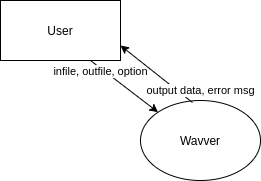
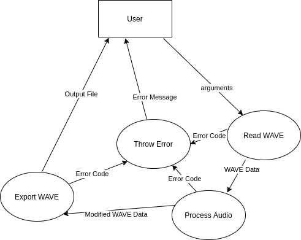
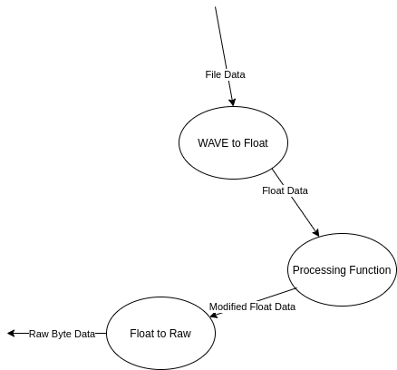
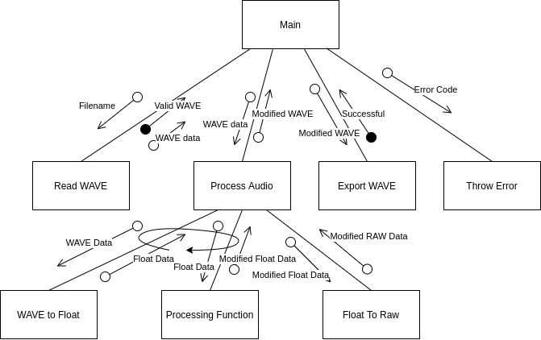
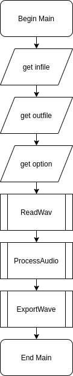
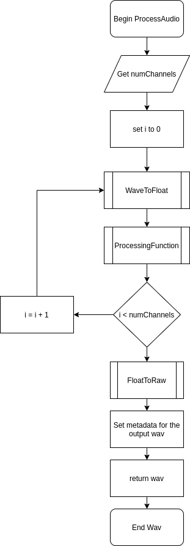

# SDD Major Project


<center><b>Source Code: <a href="https://github.com/minerscale/sdd_proj">https://github.com/minerscale/sdd_proj</a><br>
Binaries: <a href="https://github.com/minerscale/sdd_proj/releases/tag/v1.0">https://github.com/minerscale/sdd_proj/releases/tag/v1.0</a>
</b>
</center> 

**Table Of Contents:**

* TOC
{:toc}

# Defining and Understanding the Problem

## The Problem

I wanna put a bunch of cool effects on my music. Specifically, I want to be able to create my own effects which achieve things not yet created by software which already exists. I need something that reads a .wav file and outputs a modified .wav file. I want it to be fast and I want a reasonable number of effects (at least 5). I won't go as far as to make an autotune effect because things like that are very difficult and require a very fundamental understanding of audio processing.

This project should not be too hard to implement. I would imagine it's not too many hours of work and once I get the framework for each audio processing algorithm going, the rest of the project will be a breeze. It costs nothing and my time costs nothing as it it a school project. The user would only need a copy of Windows or Linux and a computer capable of processing the audio faster than the heat death of the universe. I could bundle a python runtime to make running the program even easier. 

I think I'm going to use an open source licence. I don't see the reason of using anything else. I think it's the best option so I can give back to the people who so graciously give their time. Apart from the actual licence on the software and it's dependencies, I doubt there are any legal ramifications of digitally manipulating audio except for maybe if the audio you are trying to manipulate has some licence on it that prevents you from editing it, though I'm pretty sure it would really only prevent you from releasing it to the public, which is beyond the scope of what this piece of software can do.

## Design Specifications

**Developer's Perspective:** I'm going to use the RAD development approach as I feel it is the least intrusive to my process giving just enough structure to my work without utterly consuming me with documentation. RAD simply means doing some requirements planning, which involves determining what environment (languages, frameworks etc.) I will be using so I can begin to develop the software itself as soon as possible. I do not think it is necessary to use something more rigorous like the structured approach because I am a one man team; I do not have to consider other people when writing my software. Four weeks is not enough time to completely forget what I'm up to. In terms of data types, I'm going to use integers, floats, like, all of them. And for data structures, I'm going to use lists, and *strings?* (Are strings a data structure or a data type?).

**User's Perspective:** I wish to have a GUI to make the user more comfortable using my program, I also don't want to restrict the user from using the command line tool if they so please (it is faster and more automatable). I need the language to be formal and dry as if a tech startup wrote it. No style and no grace. I need it to accept a readily available file format. WAV for example. I for sure need to get the CLI interface working first as a priority action before anything else as having the program working nicely takes precedence over any sugary GUIs. I want the software to be very approachable with no dependencies whatsoever, incredibly easy to install.

## Modelling

I decided to use [draw.io](https://draw.io) for my modelling diagrams because it produces good looking graphs with a wonderful interface. Compared to handwritten documents an undo button and the ability to adjust arrows once they are put down make the whole process of producing a structure chart or DFD much more streamlined.

### Context Diagram



### Level I DFD



### Level II DFD



### Structure Chart



### IPO Chart

| **Input**                       | **Process**                                                  | **Output**                                 |
| ------------------------------- | ------------------------------------------------------------ | ------------------------------------------ |
| Infile<br />Outfile<br />Option | Open the infile and read the data into a structure.<br />Convert the data to floating point data to more easily edit it.<br />Modify the data.<br />Convert it back to a bytestring.<br />Write it back to a file. | Modified File<br />Potential Error Message |

# Planning and Design of Software Solutions

## Algorithms

### Pseudocode

Note: These code blocks don't support underlining as they only take plaintext. I've used double underlines on either side of the function as a stand in for this feature.

```
BEGIN Main(infile, outfile, option)
	Let wav = __ReadWav__(infile)
	Let wavOut = empty wav object with name outfile
	__ProcessAudio__(wav, wavOut, option)
	__ExportWave__(wavOut)
END Main

===============================================================================

BEGIN ReadWav(filename)
	Let wav = empty wav object with name filename
	Let wavFile = byte data read in by the file pointed to by filename
	Let wav.numChannels = wavFile[22] (22nd byte as a 16 bit int)
	Let wav.sampleRate = wavFile[24] (24th byte as a 32 bit int)
	Let wav.bitsPerSample = wavFile[34] (34th byte as 16 bit int)
	
	Let dataPointer = byte pointing to the data block in the wav file
	Let wav.numSamples = wavFile[dataPointer + 4] / ((wav.bitsPerSample / 8) * wav.numChannels)
	Let wav.dataPointer = dataPointer + 8
	
	RETURN wav
END ReadWav

===============================================================================

BEGIN ProcessAudio(wavIn, wavOut, option)
	Let floatData = empty two dimentional array of size wavIn.numChannels by wavIn.numSamples
	FOR i = 0 TO wavIn.numChannels STEP 1
		floatData[i] = __WaveToFloat__(WavIn, i)
		floatData[i] = ProcessingFunctions[option](floatData[i]) <- list of functions!
	NEXT i
	wavOut.data = __FloatToRaw__(wavIn.numSamples, wavIn.numChannels, floatData)
	
	set wavOut's metadata to the same as wavIn's
	
	RETURN wavOut
END ProcessAudio

===============================================================================

BEGIN WaveToFloat(wav, channel)
	Let floatData = array of floats of size wav.numChannels
	
	CASEWHERE wav.bitsPerSample is
		8:  floatData = wav.data taken one byte at a time from interleaved channels
		16: floatData = wav.data taken two bytes at a time from interleaved channels
		24: floatData = wav.data taken three bytes at a time from interleaved channels
		32: floatData = wav.data taken four byte at a time from interleaved channels
	ENDCASE

	RETURN floatData
END WaveToFloat

===============================================================================

BEGIN FloatToRaw(numSamples, numChannels, floatData)
	Let rawData = array of bytes of size numSamples * numChannels
	FOR i = 0 TO numSamples STEP 1
		FOR j = 0 TO numChannels STEP 1
			rawData[numChannels*i + j] = (2^15 - 1)*floatData[j][i]
		NEXT j
	NEXT i
	
	RETURN rawData
END FloatToRaw

===============================================================================

BEGIN ExportWave(wav)
	write the header and wav file data to a file named wav.name
END ExportWave
```

### Flowcharts






## Selection of Language to be used

Ideally my code would be mostly or completely cross platform between Windows, Mac and Linux. I'm not too concerned about Mac support but Windows support is important because everybody has a Windows computer and Linux support is important because I'll be developing the software on Linux. This narrows down my choice of language to one with support for many languages, an example of a language that would not be suitable due to support would be something like Visual Basic. Not only is it a terrible language but I doubt there's any way to get it to compile on Linux. I've therefore narrowed my choices down to two languages:

### Python

- Very easy to prototype with.
- Completely cross platform between Windows Mac and Linux.
- Requires the python run-time to run, even in production.
- Extremely slow for programs which do a lot of looping.
- Manipulation of binary data is difficult.
- GUI work is easy.

I like Python a lot. I think it is particularly well suited to the end-user friendly design that I want to go for. The speed at which you can develop programs is also very important to me as I do not have a lot of time to get an implementation complete. The drawback of very slow execution of code could be enough to prevent me from using it however, as I need to loop over arrays potentially over a million items in size. The memory usage and speed of the work on the CPU would just be far too much to consider. On top of this, dealing with binary data, as in the data inside WAV files is just the worst in python, giving another reason why it is not a language I want to consider.

### C

- Difficult to write, with static types and pointers.
- Mostly cross platform. One must be careful about which functions in C is a pain. I do enjoy it's syntactic simplicity at the expense of it's low-levelness, d the standard library are supported on Windows.
- Produces standalone binaries, ideal for production code.
- One of the fastest programming languages under the sun if worked with correctly.
- Manipulation of binary data is done in the same way normal data is dealt with: on a low level.
- Cross platform GUI work is more or less, impossible.

C is a pain. I do enjoy it's syntactic simplicity at the expense of it's low-levelness, dealing with memory allocation and the dreaded pointer. But it's fast. Extremely fast. That is the reason why I am going for C. I'm 99% confident Python would hang for 10+ seconds on a 2-3 minute WAV file performing even the simplest task. C could get the job done in likely less than a tenth of a second. Thus I feel like because of this reason, above all else, I'm picking C.

# Implementation of Software Solutions

## Interface Design

My interface I have decided due to time constraints to be for the command line. I want the syntax to look like this:

```bash
$ [PROGRAM] [OPTION] [INFILE] [OUTFILE]
```

If the number of arguments is incorrect we should print the program's help message which looks like this in C:

```C
printf("Usage: %s ACTION SOURCE DEST\n"
	   "Possible values for ACTION:\n"
	   "    1: quicksort the data\n"
	   "    2: sqrt the data\n"
	   "    3: reverse the data\n"
	   "    4: make the data all steppy and weird\n"
	   "Example: %s 1 in.wav out.wav\n", argv[0], argv[0]);
```

If the option is invalid or the source file is incorrect or we cannot write to the destination file then we should print an error message as follows:

```
Error: [ERROR MESSAGE]
```

If the operation was successful we simply print nothing to the screen and the shiny new file will be sitting there.

The interface is consistent through it's close relationship with other command line tools such as `cp`, which copies files or `touch` which will create a new file if it doesn't exist or if it does updates the date of modification. These programs take simple positional arguments and when successful return nothing.

My target audience is me. I'm very proficient with the command line to the point where a GUI would actually slow me down. As a result, a GUI is not only difficult but also a thankless task, as I wouldn't even use it.

## Project Log

### 10/06/2020

I'm now getting to starting work on the actual programming! I started out by configuring my development environment: creating a src folder for my source files, a doc folder for my documentation, a readme and a sublime-project file so I could easily load and manipulate the project in sublime text, my text editor of choice. I then went on to create a Makefile so I could easily build my program in one simple command. I wrote the beginnings of `error.c`, `main.c`, `process_audio.c` and `sound_functions.c` with a focus on getting WAV reading capabilities fully functional. The file `main.c` contained code simply to test the `read_wav` function I created. Here's an excerpt:

```C
#include <stdio.h>

#include "process_audio.h"
#include "sound_functions.h"

int main(int argc, char *argv[]){
	if (argc >= 2){
		WAVE wav = read_wav(argv[1]);

		debug_WAVE(wav);
	}
}
```

Where `debug_WAVE` is a function which will print a bunch of information about the wav object for testing purposes:

```C
void debug_WAVE(WAVE wav){
	printf ("name: %s\n", wav.name);
	printf ("num_channels: %d\n", wav.num_channels);
	printf ("sample_rate: %d\n", wav.sample_rate);
	printf ("bits_per_sample: %d\n", wav.bits_per_sample);
	printf ("num_samples: %d\n", wav.num_samples);
}
```

The `read_wav` function itself I wrote in a well commented way which follows the psuedocode quite closely, with some concessions created by the fact I was using C and that it is much more low level. Here is that function:

```C
WAVE read_wav(char *filename){
	// The output data structure
	struct WAVE ret;

	// Open file for reading
	FILE *fp = fopen(filename, "rb");
	if (fp == NULL) throw("could not open file for reading", 2);

	// Find the length of the file
	fseek(fp, 0L, SEEK_END);
	int wav_size = ftell(fp);
	rewind(fp);

	// Allocate just enough memory to fit the file in, copy over and close the file
	char *wav_file = malloc(wav_size + 1);
	fread(wav_file, 1, wav_size, fp);
	fclose(fp);

	// Check if the file is actually a WAV file.
	if (strncmp("WAVE", wav_file + 8, 4) != 0) throw("invalid .wav file", 3);

	// I only want to support WAV files with no compression. Otherwise it is way too much work.
	if (*((uint16_t*)(wav_file + 20)) != 1) throw("invalid .wav file", 3);

	// Get some metadata
	ret.name = filename;
	ret.num_channels = *((uint16_t*)(wav_file + 22));
	ret.sample_rate = *((uint32_t*)(wav_file + 24));
	ret.bits_per_sample = *((uint16_t*)(wav_file + 34));
	
	// Search through the chunks until we find the 'data' chunk, usually it's first, but just to be safe.
	int wp = 36;
	while (strncmp("data", wav_file + wp, 4) != 0) {
		wp += 8 + (*((uint32_t*)(wav_file + 4)));
		if (wp > wav_size) throw("invalid .wav file", 3);
	}

	// Get the total number of samples and add a pointer to the data itself to the data structure.
	// A benefit of this is that we only have to load the file into memory once!
	ret.num_samples = (*((uint32_t*)(wav_file + wp + 4)))/((ret.bits_per_sample/8) * ret.num_channels);
	ret.data = wav_file + wp + 8;

	return ret;
}
```

An `throw` function was also created for error handling, which is essential when dealing with completely arbitrary input to a program. Here is that:

```C
#include <stdio.h>
#include <stdlib.h>
void throw(char *msg, int code) {
	fprintf(stderr, "Error: %s\n", msg);
	exit(code);
}
```

I also created a quick stub for the `process_audio` function which I will be fleshing out later:

```C
int process_audio(char *filename){
	return 0;
}
```

### 11/06/2020

I had my progress meeting today. I went in with the expectation to be told what was and wasn't a good idea with the code for my program with to best practices and what is best for the course. I also wanted to see where I was up to with my documentation.

What Ms Hadley and I talked about most was the structure of my code, specifically pertaining to exiting the program in 'random' points due to errors. Ms Hadley felt as if it was spaghetti code and not best practice, and on top of that difficult to implement under a top-down model. I tend to agree with her but I'm finding it difficult to come up with an alternative that works well. I'm sure I'll figure it out. The specific code in question was to do with how the `throw` function worked and how it was called at multiple points from multiple functions. Here is an example:

```C
// Open file for reading
FILE *fp = fopen(filename, "rb");
if (fp == NULL) throw("could not open file for reading", 2);
```

Since the `throw` function quits the program, it could be seen that our soul exit point for the program is not the `main` function, and thus not adhering to the 'top down development' principles which we should be following.

Hopefully I'll have a solution soon.

### 14/06/2020

I think I've come up with a good solution to the `throw` function now. Instead of calling a `throw` function from anywhere, the error is passed using the global variable `errno` (implemented by C itself, *not* me). The error, once daisy chained back to the `main` function can be safely passed to a new throw routine which allows for the printing of all sorts of different system errors using `perror` (i.e. running out of memory, unable to open files for reading, etc.) whilst also allowing me to implement custom errors for when wav files are unsupported (as in files which are in a really weird format) or invalid. The function looks like this:

```C
char *errors[] = {
	"Invalid .wav file.",
	"Unsupported .wav format."
};

void throw(int error){
	size_t num_msg = sizeof(errors)/sizeof(errors[0]);
	int error_index = -error - 1;

	// Check if the error is custom or not.
	// +ve values for system errors, -ve values for custom errors.
	if ((error_index < num_msg) && (error_index >= 0)){
		fprintf(stderr, "Error: %s\n", errors[error_index]);
	} else {
		// If it is a global error use the builtin error handling.
		errno = error;
		perror("Error");
	}
}
```

On top of this refactoring of the error handling system I added a couple more functions. Critically, I added a way to export and playback wav files so I can more easily debug and verify that the `read_wav` function was correctly functioning. Unsurprisingly, I called this function `export_WAVE`, which takes a pointer to a wav object and writes it to a file, header and all. Here is that function:

```C
int export_WAVE(WAVE *wav){
	char *wav_header = malloc(44);
	if (!wav_header) return errno;
	// Write a scaffold of the data to memory.
	memcpy(wav_header, "RIFF    WAVEfmt                     data", 40);

	// Populate empty parts
	((int32_t *)wav_header)[1] = 36 + (wav->num_samples)*(wav->num_channels)*(wav->bits_per_sample/8);
	((int32_t *)wav_header)[4] = 16;
	((int16_t *)wav_header)[10] = 1;
	((int16_t *)wav_header)[11] = wav->num_channels;
	((int32_t *)wav_header)[6] = wav->sample_rate;
	((int32_t *)wav_header)[7] = (wav->sample_rate)*(wav->num_channels)*(wav->bits_per_sample/8);
	((int16_t *)wav_header)[16] = (wav->num_channels)*(wav->bits_per_sample/8);
	((int16_t *)wav_header)[17] = wav->bits_per_sample;
	((int32_t *)wav_header)[10] = (wav->num_samples)*(wav->num_channels)*(wav->bits_per_sample/8);

	// Write to the file.
	FILE *fp = fopen (wav->name, "wb");
	if (!fp) return errno;
	fwrite(wav_header, 1, 44, fp);
	fwrite(wav->data, 1, (wav->num_samples)*(wav->num_channels)*sizeof(int16_t), fp);
	fclose(fp);

	// Free up unused memory.
	free(wav_header);

	// Return a success.
	return 0;
}
```

I also added another helper function `float_to_raw` which takes in an array of arrays of floats and interleaves it back as 16 bit multi-channel audio data as per the wav file specifications.

```C
// 16 bit WAV export supported only because I'm lazy.
char *float_to_raw(int num_samples, int num_channels, float **data){
	int16_t *ret = malloc(num_samples*num_channels*sizeof(int16_t));
	if (!ret) return NULL;

	for (int i = 0; i < num_samples; ++i){
		for (int j = 0; j < num_channels; ++j){
			ret[num_channels*i + j] = 32767*data[j][i];
		}
	}
	return (char *)ret;
}
```


In addition to these two funcitons, I added another function which allows me to dump the raw data out to `stdout` so I could run it with a program that can take raw data and play it to check if it works such as `aplay`. This function looks like this:

```C
// Terrible function for checking the validity of my read function
void playback(WAVE *wav){
	int num_bytes = (wav->num_channels)*(wav->num_samples)*(wav->bits_per_sample)/8;
	fwrite(wav->data,1,num_bytes,stdout);
}
```

I ran it with a little bit of custom jank with the `main` function and it worked perfect as expected:

```C
int main(int argc, char *argv[]){
	// Have we supplied an argument?
	if (argc >= 2) {
		WAVE *wav = read_wav(argv[1]);

		if (wav == NULL){
			throw(errno);
			return errno;
		}

		float *data_float_c0 = WAVE_to_float(wav, 0);
		float *data_float_c1 = WAVE_to_float(wav, 1);

		float *channel_data[] = {data_float_c0,data_float_c1};

		sort_audio(wav->num_samples, data_float_c0);
		sort_audio(wav->num_samples, data_float_c1);
		
		char *raw_data = float_to_raw(wav->num_samples,wav->num_channels,channel_data);

		free(data_float_c0);
		free(data_float_c1);

		WAVE converted;

		converted.name = "./test.wav";
		converted.num_channels = 2;
		converted.sample_rate = wav->sample_rate;
		converted.bits_per_sample = 16;
		converted.num_samples = wav->num_samples;
		converted.base_ptr = raw_data;
		converted.data = raw_data;

		int err = export_WAVE(&converted);
		if (err){
			throw(err);
			return err;
		}

		debug_WAVE(&converted);

		destroy_WAVE(wav);
		free(converted.base_ptr);
	}
	// If we haven't supplied an argument print the help.
	else {
		printf("Usage: process [OPTION] ... SOURCE DEST\n");
	}
}
```

Of course, this `main` function is getting unwieldy. I need to make this processing apply to a more general gamut of wav files and also take this code out of `main` and put it into `process_audio`. That's a job for next time however.

### 22/06/2020

From the last time I made an entry, I added a few things. Firstly I added two more audio processing functions on top of `qsort`. I added `sqrt` and `reverse`. Secondly, I refactored and generalised a lot of the functionality of my program in a big way. I would consider my program now feature complete. I moved a lot of my code from `main` to `process_audio` and added support for non-stereo audio. Here's the code here:

```C
// wav_in must have same basic metadata as wav_out.
int process_audio(WAVE *wav_in, WAVE *wav_out, int function){
	float **data_f = malloc(sizeof(float*) * wav_in->num_channels);

	for (int i = 0; i < wav_in->num_channels; ++i){
		data_f[i] = WAVE_to_float(wav_in, i);
		if (data_f[i] == NULL){
			return errno;
		}
		function_table[function](wav_in->num_samples, data_f[i]);
	}
	
	char *raw_data = float_to_raw(wav_in->num_samples, wav_in->num_channels, data_f);
	if (raw_data == NULL){
		return errno;
	}

	for (int i = 0; i < wav_in->num_channels; ++i){
		free (data_f[i]);
	}
	free(data_f);

	wav_out->bits_per_sample = 16;
	wav_out->num_samples = wav_in->num_samples;
	wav_out->sample_rate = wav_in->sample_rate;
	wav_out->num_channels = wav_in->num_channels;
	wav_out->base_ptr = raw_data;
	wav_out->data = raw_data;

	return 0;
}
```

I had a little bit of trouble with memory allocation but it turned out okay in the end. `valgrind` was a godsend in this situation. It is a debugger which lets you know about erroneous memory accesses and memory leaks. It was easy to use and it helped me find various bugs which completely broke the program. Perhaps most hilariously, the title of the output files were a garbled mess because I set the name of the output file after writing it to disk. `valgrind` let me know that this was the problem with the program and for that I am forever grateful for making my program less memory intensive and bug-free.

I yet again updated the main function to run the full flow of the program as set by the DFD and structure chart:

```C
int main(int argc, char *argv[]){
	// Have we supplied an argument?
	if (argc == 4) {

		// Read the WAVE file out
		WAVE *wav = read_wav(argv[2]);
		if (wav == NULL){
			throw(errno);
			return errno;
		}

		// Create the output WAVE struct
		WAVE *wav_out = malloc(sizeof(WAVE));
		if (wav_out == NULL){
			throw(errno);
			return errno;
		}

		// Set the name of the struct to the input
		wav_out->name = argv[3];

		// Convert the input string into an integer
		int function_index = atoi(argv[1]);
		
		// If it's too big complain and exit
		if (function_index > 4 || function_index <= 0){
			throw(-3);
			return -3;
		}

		// Do the action to the audio
		int err = process_audio(wav, wav_out, function_index - 1);
		if (err != 0){
			throw(err);
			return err;
		}

		// Write the audio to disk
		err = export_WAVE(wav_out);
		if (err != 0){
			throw(err);
			return err;
		}

		// Clear all memory before quitting.
		destroy_WAVE (wav);
		destroy_WAVE (wav_out);
	}

	// If we haven't supplied an argument print the help.
	else {
		printf("Usage: %s ACTION SOURCE DEST\n"
			   "Possible values for ACTION:\n"
			   "    1: quicksort the data\n"
			   "    2: sqrt the data\n"
			   "    3: reverse the data\n"
			   "    4: make the data all steppy and weird\n"
			   "Example: %s 1 in.wav out.wav\n", argv[0], argv[0]);
	}
}
```

It also prints a helpful help dialogue when the user doesn't put the right number of arguments in (which means all the usual ways to invoke the help of a command line program work, such as ./program --help, as this only has one argument). I thought that was a useful interface design.

### 23/06/2020

Last entry. All I did was add an extra piece of functionality and cleaned up the code a bit. Nothing significant since my last edit. Here's an excerpt of the `step` function:

```C
void step(int num_samples, float *data){
	for (int i = 0; i < num_samples; ++i){
		data[i] = ((int)(16*data[i]))/16.0;
	}
}
```

# Testing and Evaluation of Software Solutions

## Testing the software solution & End User Testing

I feel like this solution is a pretty good one for the specifications I set out to achieve. I'm yet to find a bug with the finished version so far and it does what I want it to do with modularity, allowing for the easy addition of other, perhaps more complicated audio manipulation functions. I asked both Joon and Felix from year 10 to try to use and break my software using various inputs - such as invalid wav files, empty wav files, invalid options, invalid output files, attempting to write the executable to itself.

What I found was that they could figure out the usage of my software from the help message easily (after I did the readme's job of telling them to fire up a terminal) and the design was very user-friendly. I made sure to test each function as I made them using a variety of methods: Using printf to tell me where parts of the program was failing, writing small programs to explicitly test individual programs and writing test functions to make it easier to tell what has gone wrong. I also performed tests of the whole program where applicable, downloading many different WAV files in different formats to test each and every branch of my functions to make sure each line of code was working correctly.

```C
// Terrible function for checking the validity of my read function
void playback(WAVE *wav){
	int num_bytes = (wav->num_channels)*(wav->num_samples)*(wav->bits_per_sample)/8;
	fwrite(wav->data,1,num_bytes,stdout);
}

void debug_WAVE(WAVE *wav){
	printf ("name: %s\n", wav->name);
	printf ("num_channels: %d\n", wav->num_channels);
	printf ("sample_rate: %d\n", wav->sample_rate);
	printf ("bits_per_sample: %d\n", wav->bits_per_sample);
	printf ("num_samples: %d\n", wav->num_samples);
}
```

**Original**

<audio controls="controls">
	<source type="audio/wav" src="audio/test.wav"></source>
	<p>Your browser does not support the audio element.</p>
</audio>
**Square Root**

<audio controls="controls">
	<source type="audio/wav" src="audio/sqrt.wav"></source>
	<p>Your browser does not support the audio element.</p>
</audio>
This kind of distortion is to be expected, as when taking the square root of the data, the negative component disappears and the rest of the data becomes distorted. Another feature is that it should get louder, because the square root of a number between 0 and 1 is bigger than the number itself, e.g. sqrt(0.5) = 0.707, which is bigger than 1/2.

**Reverse**

<audio controls="controls">
	<source type="audio/wav" src="audio/reverse.wav"></source>
	<p>Your browser does not support the audio element.</p>
</audio>
Okay, not sure what you'd expect here but I'm pretty sure that's it.

**Quicksort**

<audio controls="controls">
	<source type="audio/wav" src="audio/qsort.wav"></source>
	<p>Your browser does not support the audio element.</p>
</audio>
it is expected that it sounds like nothing, putting it into Audacity confirms that it did indeed sort the audio by speaker position.

**Step**

<audio controls="controls">
	<source type="audio/wav" src="audio/step.wav"></source>
	<p>Your browser does not support the audio element.</p>
</audio>
Again, you expect a kind of bitcrushed effect, which we hear!


I also tried a longer file (37MB!) also rate my Minecraft song I put a lot of work into it.

**Original**

<audio controls="controls">
	<source type="audio/mp3" src="audio/minecraft.mp3"></source>
	<p>Your browser does not support the audio element.</p>
</audio>
**Reversed**

<audio controls="controls">
	<source type="audio/mp3" src="audio/minecraft-reverse.mp3"></source>
	<p>Your browser does not support the audio element.</p>
</audio>
Works great. I think this software is ready to ship.

# Time Info

According to Toggl, I spent approximately 26 hours, 52 minutes and 15 seconds on this project. I would imagine at least 6 of those hours were distracted time however bringing it down to probably a more accurate 21 hours. I wouldn't consider that too bad for a month long project. To be averaging about 30-40 minutes a day isn't too tricky.


I spent a total of about 3 hours defining and understanding the problem, 6 or so hours on the Design Specifications (creating flowcharts etc.), 14 hours on the implementation of software solutions, which was pretty much programming and writing those process diary entries. And lastly 3 or 4 hours on testing the software, talking to people about it's functionality and stuff making it look all nice.

## Why Toggl?

Because it's what the task said and I didn't care much for comparing other solutions when Ms Hadley suggested a perfectly good solution for us.

# Source Code

<center><b>Source Code: <a href="https://github.com/minerscale/sdd_proj">https://github.com/minerscale/sdd_proj</a><br>
Binaries: <a href="https://github.com/minerscale/sdd_proj/releases/tag/v1.0">https://github.com/minerscale/sdd_proj/releases/tag/v1.0</a>
</b>
</center> 

Thanks for watching - Aaron

